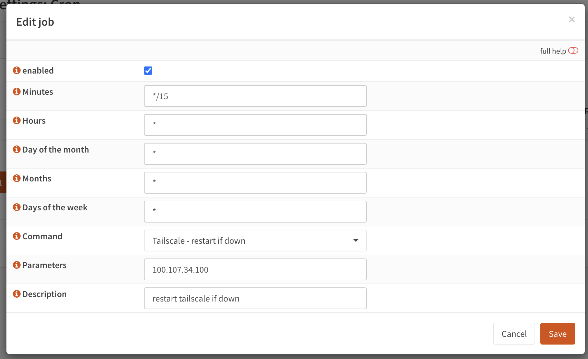

# Tailscale and FreeBSD Integration Workaround

## Overview
This repository addresses a known issue where Tailscale static routes are lost on OPNsense following configuration changes to you tailnet. To ensure continuous network connectivity within your tailnet, I've developed a workaround that monitors the accessibility of a specified IP address within the tailnet. If the ping to this IP fails, indicating a potential loss of Tailscale static routes, the Tailscale service is automatically restarted to restore connectivity.

## Security Disclaimer
Security is paramount, especially when modifications involve your firewall. I strongly advise against blindly trusting external sources, including this repository. Before implementing any changes, thoroughly review and understand the code. Your network's security and integrity depend on due diligence.

## Implementation Guide

1. Clone the repo
```bash
git clone https://github.com/ChrisTracy/tailscaleTools /var/tailscaleTools
```

2. Make the script executable
```bash
chmod +x /var/tailscaleTools/scripts/tailCheck.sh
```

3. Copy the configd action file (this is what calls the script and makes it show up in the GUI)
```bash
cp /var/tailscaleTools/config/actions_tailcheck.conf /usr/local/opnsense/service/conf/actions.d
```

4. Restart the configd service
```bash
service configd restart
```

5. Open the opensense GUI and navigate to **System>Settings>Cron**.
   - Create a new cron job like the one below (mine is set to run every 15 minutes, adjust as needed).
   - CHANGE THE PARAMETER FIELD TO A TAILNET IP THAT IS ALWAYS ONLINE IN YOUR TAILNET.
   - Click **Save**
   - Click **Apply**



6. Wait 1 minute and check the log. You should see a "ping successful" or "Ping failed, restarting Tailscale service..." message.
```bash
cat /var/log/tailscaleTools/tailCheck.log
```
